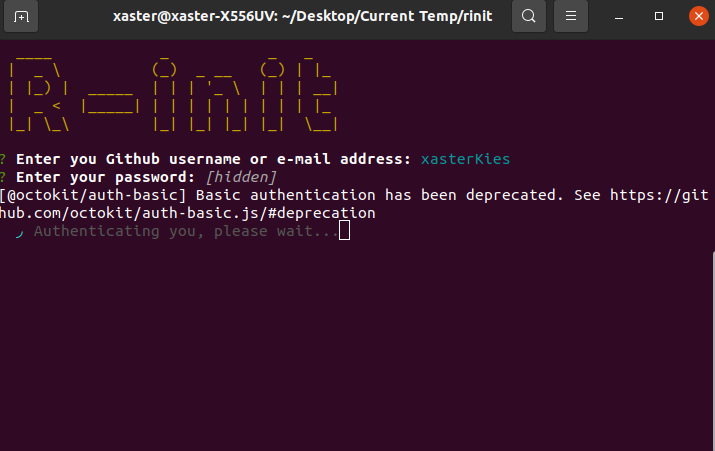

# R-init

> A CLI that helps you initialize your github reposiotries from your terminal.



I started this project because i always had to move out from my workspace when I wanted to create or initialize new repositories to work on and that always made me loose some focus along the way. In an attempt of being productive i started coding this simple tool.


## ⚡ Prerequisites

- Node and npm
  - Install using this tutorial for [linux/mac](https://docs.npmjs.com/downloading-and-installing-node-js-and-npm) and [windows](https://phoenixnap.com/kb/install-node-js-npm-on-windows)


## 🔧 Setting up the Project

1. Fork repository

2. Clone the forked repository in prefered directory

   ```bash
   git clone <project-url>
   ```

3. Enter project directory
  
   ```bash
   cd r-init
   ```

4. Initialize project

   ```bash
   git init
   ```

## ⚙️ Running the project

1. Install dependencies

    ```bash
    npm install
    ```

2. Start the project (in root of the project folder)

   ```bash
   node index
   ```


## 🤝 Contributing
If you will like to contribute to this project, simply follow the steps in the contribution guide or reach out to me on twitter @xasterKies if you need any direction.   

